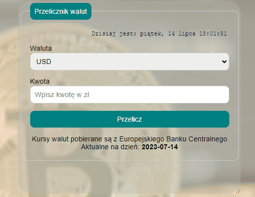

# Currency-converter-react 
This project is the next step in gaining frontend developer skills by moving your second project to React.
and it was launched with [Create React App](https://github.com/facebook/create-react-app).

## Demo
http://localhost:3000/currency-converter-react

## Tools&Technologes

- HTML
- CSS
- JavaScript
- Normalize CSS
- BEM convention
- Flex / Grid
- JavaScript XML
- React App
- WebPack
- Babel
